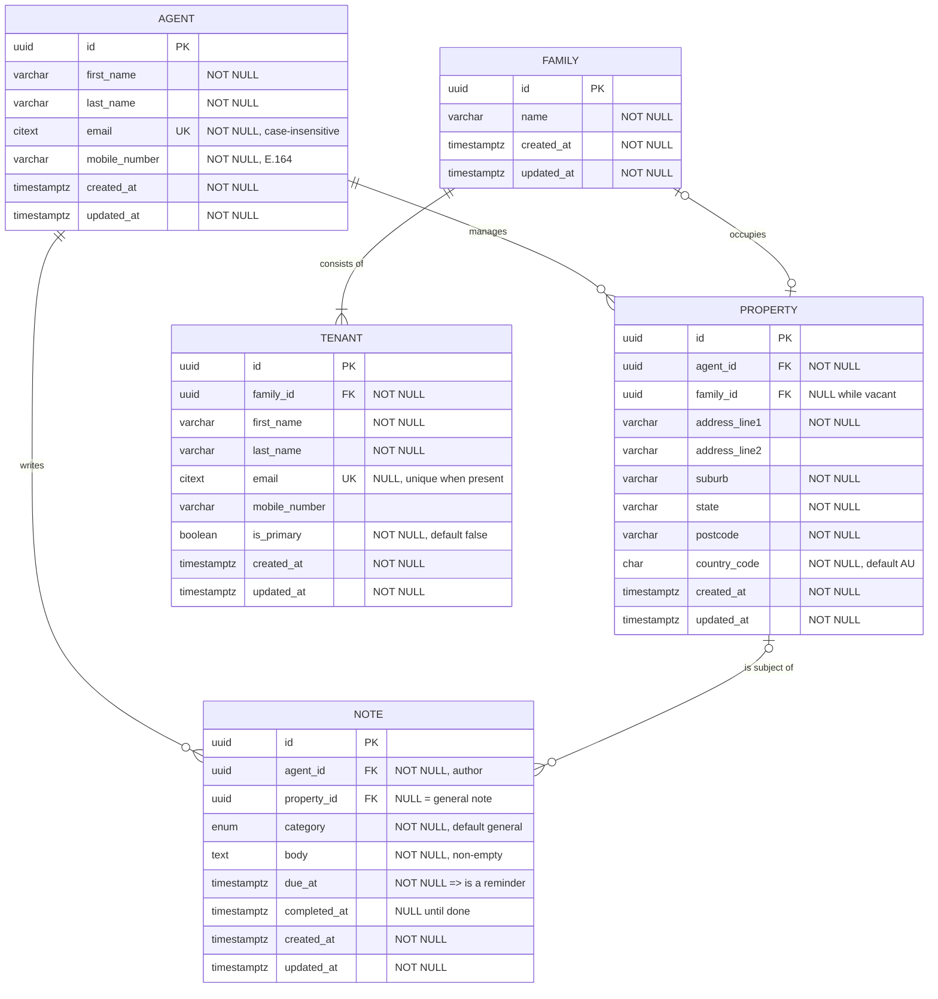

# Property Agent - Fullstack Take-home

TypeScript monorepo: REST API for property agent CRUD, plus a Vue client.

## Structure

| Path | Purpose |
| --- | --- |
| `apps/api` | REST API, in-memory store |
| `apps/web` | Vue 3 client |
| `docs` | Relational data model |

## Relational data model

Brief 2a. Five tables, rendered below so it is visible without opening a file.
[`docs/schema.sql`](docs/schema.sql) is the authoritative definition;
[`docs/verify.sql`](docs/verify.sql) proves it behaves as documented, and
[`docs/README.md`](docs/README.md) explains every decision.

Domain: a **property agent** manages multiple **rental properties**. Each
property is leased to a single **family**, which has one or more **tenants**.
An agent writes **notes and reminders** against a property to drive actions
such as maintenance or pest control.



### Relationships

| From | To | Cardinality | Rule |
| --- | --- | --- | --- |
| `agent` | `property` | 1 : 0..N | One managing agent per property. Deleting an agent who still holds properties is refused (`ON DELETE RESTRICT`), never cascaded. |
| `family` | `property` | 0..1 : 0..1 | One family per property, one current property per family (`UNIQUE (property.family_id)`). Vacant means `family_id IS NULL`. |
| `family` | `tenant` | 1 : 1..N | A tenant belongs to exactly one family. The `1..N` minimum is enforced in the application, not the schema - see below. |
| `agent` | `note` | 1 : 0..N | Every note has one authoring agent. |
| `property` | `note` | 0..1 : 0..N | A note targets a property, or is a general agent note (`property_id IS NULL`). |

A reminder is not a separate table: it is a note with a `due_at`, outstanding
while `completed_at IS NULL`.

### Where "1 or more tenants" is enforced

In the application, not the schema: a family is created together with its first
tenant, and the last tenant of an occupied property cannot be removed.

Not a shortcut - **no relational schema can express it.** `tenant` holds the
pointer to `family`, so the family row must exist first, and at that instant it
legally has zero tenants. A `CHECK` cannot query another table, an immediate
trigger rejects that legitimate first insert, and a deferred one still misses
the last tenant being deleted later. Working through all three, with the actual
Postgres errors, is in [`docs/README.md`](docs/README.md).

What the schema does instead is make the other half of the rule *impossible*
rather than merely checked: a property cannot reference two families, because
there is no second column to hold one.

Known limitation: no `lease` table, so `property.family_id` records who lives
there *now* with no tenancy history. Fix documented in
[`docs/README.md`](docs/README.md).

## Requirements

Node >= 20, pnpm >= 9.

## Getting started

```bash
pnpm install
pnpm dev   # runs apps/api on :3001 and apps/web on :5173 together
```

Then open http://localhost:5173 for the form.

| Read next | For |
| --- | --- |
| [`apps/api/README.md`](apps/api/README.md) | Endpoints, the curl requests the brief asks for (list, get-one, delete), error responses, and the ETag/If-Match contract |
| [`apps/web/README.md`](apps/web/README.md) | The Vue client, FE vs BE error handling, and the client side of optimistic concurrency |
| [`docs/README.md`](docs/README.md) | The data model above in full: every constraint, how to execute the schema, and what it deliberately leaves out |

## Checks

```bash
pnpm typecheck
pnpm test        # 33 tests, over real HTTP
pnpm build
```
