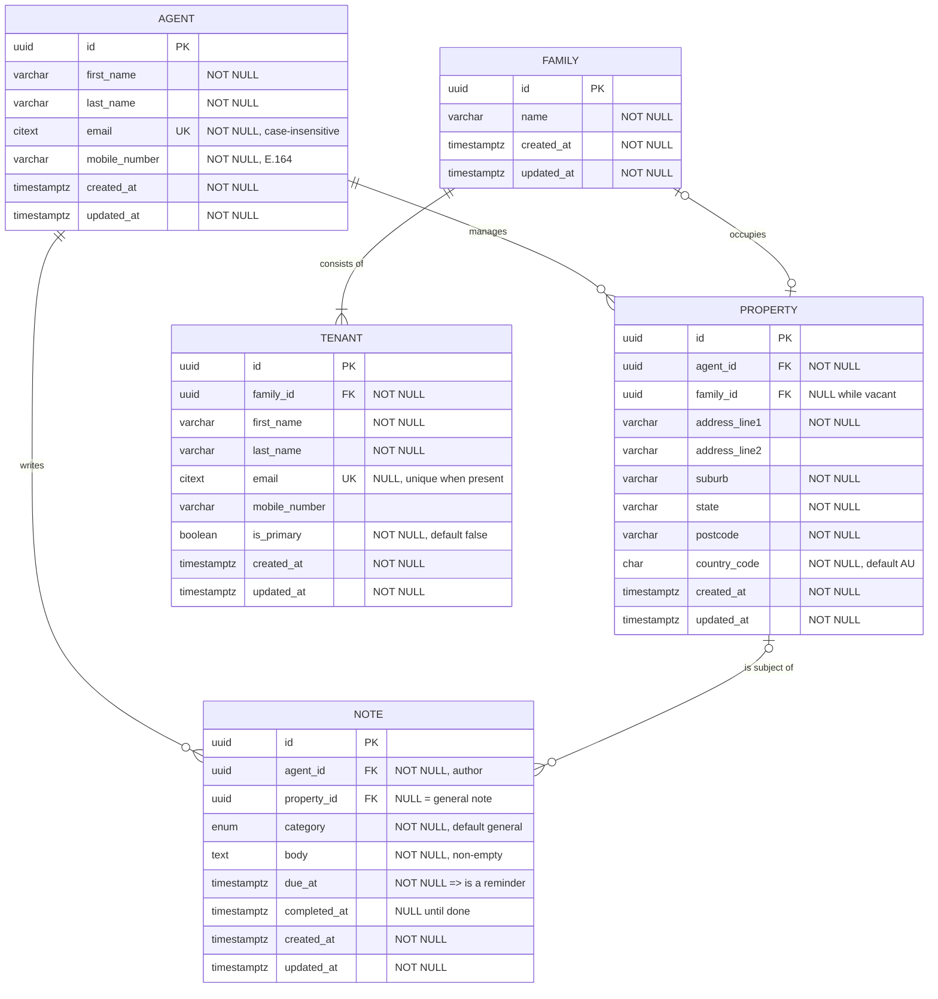

# Relational data model

Domain: a **property agent** manages multiple **rental properties**. Each
property is leased to a single **family**, which has one or more **tenants**.
An agent writes **notes and reminders** against a property to drive actions
such as maintenance or pest control.

[`schema.sql`](./schema.sql) is the authoritative definition. The diagram and
prose below explain it; [`verify.sql`](./verify.sql) proves it behaves as
documented. [`data-model.dbml`](./data-model.dbml) renders the same model at
[dbdiagram.io](https://dbdiagram.io).

The application stores data in memory as the brief requires - PostgreSQL is
used only to make this model executable, and is not needed to run the API or
the web client.

## Verifying the model

```bash
docker run -d --name pg-verify -e POSTGRES_PASSWORD=verify \
  -e POSTGRES_DB=verify -p 55432:5432 postgres:16-alpine

PGPASSWORD=verify psql -h localhost -p 55432 -U postgres -d verify \
  -v ON_ERROR_STOP=1 -f docs/schema.sql -f docs/verify.sql

docker rm -f pg-verify
```

**Use a disposable database only** - the command above, or an equivalent
scratch database you don't mind losing. `schema.sql` drops and recreates
every table this model defines and commits that immediately; it is
destructive by design and there is no confirmation prompt. Never point it at
a database holding data you want to keep.

Only `verify.sql`'s own fixtures are transactional and rolled back. A failed
assertion exits non-zero.

## Diagram



## Relationships

| From | To | Cardinality | Rule |
| --- | --- | --- | --- |
| `agent` | `property` | 1 : 0..N | A property is managed by exactly one agent; an agent may manage none or many. |
| `family` | `property` | 0..1 : 0..1 | A leased property references exactly one family, and a family occupies at most one current property (`UNIQUE (property.family_id)`). A vacant property has `family_id IS NULL`; several may be vacant at once, since `UNIQUE` treats NULLs as distinct. |
| `family` | `tenant` | 1 : 0..N enforced, 1..N intended | A tenant belongs to exactly one family. The schema cannot require a family to have a tenant - see "What the schema does and does not guarantee". |
| `agent` | `note` | 1 : 0..N | Every note has exactly one authoring agent. |
| `property` | `note` | 0..1 : 0..N | A note may target a property, or be a general agent note (`property_id IS NULL`). |

### What the schema does and does not guarantee

The requirement is *"each property has 1 or more tenants belonging to a single
family."* Those are two separate claims, and the schema enforces only one.

**Guaranteed by structure - a single family.** Tenants attach to a family, and
a property holds one nullable `family_id`. There is no path by which a property
reaches two families, so no check constraint or trigger is needed. A family may
hold any number of tenants; a partial unique index limits only how many of them
are the *primary* contact.

**Left to the application - at least one tenant.** Nothing stops an empty
`family` row, and `property.family_id` may be NULL. Enforcing a minimum child
count needs a deferred constraint or a trigger, both of which make ordinary
inserts awkward. It belongs at the application's transaction boundary: create a
family together with its first tenant, and refuse to remove the last tenant of
an occupied property.

**Assumption beyond the brief - vacancy.** The brief implies every property has
tenants. `family_id` is nullable anyway, because real properties sit empty
between tenancies. This is a deliberate extension, not an oversight.

## Constraints

### Keys and uniqueness

| Table | Constraint | Type |
| --- | --- | --- |
| all | `id` | PRIMARY KEY (uuid) |
| `agent` | `email` | UNIQUE, case-insensitive (`citext`) |
| `tenant` | `email` | UNIQUE where NOT NULL |
| `property` | `family_id` | UNIQUE - a family occupies at most one current property |
| `tenant` | `(family_id) WHERE is_primary` | partial unique **index** - at most one primary contact per family |

The primary-contact rule must be a partial unique *index*; PostgreSQL has no
`WHERE` clause on table constraints:

```sql
CREATE UNIQUE INDEX one_primary_tenant_per_family
  ON tenant (family_id) WHERE is_primary;
```

Writing it as `UNIQUE (family_id, is_primary)` is valid SQL and silently wrong:
it permits one `true` row and one `false` row, capping a family at two tenants
and contradicting "1 or more tenants". `verify.sql` covers this case.

### Referential integrity

| Child | Parent | On delete |
| --- | --- | --- |
| `property.agent_id` | `agent.id` | `RESTRICT` - an agent holding properties cannot be deleted; reassign first |
| `property.family_id` | `family.id` | `SET NULL` - the property survives the tenancy ending |
| `tenant.family_id` | `family.id` | `CASCADE` - a family's tenants have no meaning without it |
| `note.agent_id` | `agent.id` | `RESTRICT` - preserve authorship |
| `note.property_id` | `property.id` | `CASCADE` - property-specific notes die with the property |

`RESTRICT` on `property.agent_id` is deliberate. Silently orphaning or
cascading away a portfolio when an agent record is removed is data loss;
forcing an explicit reassignment is the safer default.

### Check constraints

Named as they appear in [`schema.sql`](./schema.sql).

| Table | Name | Constraint |
| --- | --- | --- |
| `agent` | `agent_first_name_not_blank` | `char_length(btrim(first_name)) > 0` |
| `agent` | `agent_last_name_not_blank` | `char_length(btrim(last_name)) > 0` |
| `agent` | `agent_email_shape` | `email ~ '^[^@[:space:]]+@[^@[:space:]]+\.[^@[:space:]]+$'` |
| `agent` | `agent_mobile_e164` | `mobile_number ~ '^\+[1-9][0-9]{7,14}$'` |
| `agent` | `agent_updated_after_created` | `updated_at >= created_at` |
| `family` | `family_name_not_blank` | `char_length(btrim(name)) > 0` |
| `property` | `property_address_not_blank` | `char_length(btrim(address_line1)) > 0` |
| `tenant` | `tenant_first_name_not_blank` | `char_length(btrim(first_name)) > 0` |
| `tenant` | `tenant_last_name_not_blank` | `char_length(btrim(last_name)) > 0` |
| `note` | `note_body_not_blank` | `char_length(btrim(body)) > 0` |
| `note` | `note_completed_requires_due` | `completed_at IS NULL OR due_at IS NOT NULL` - only a reminder can be completed |
| `note` | `note_completed_after_created` | `completed_at IS NULL OR completed_at >= created_at` |

## Notes vs reminders

Modelled as **one table**. A reminder is a note that has a `due_at`; it is
outstanding while `completed_at IS NULL`. Splitting them into two tables would
duplicate `agent_id`, `property_id`, `category` and `body` to express one
nullable column of difference, and would force a UNION to answer "show me
everything on this property".

The agent's reminder queue is a partial index:

```sql
CREATE INDEX agent_reminder_queue ON note (agent_id, due_at)
  WHERE due_at IS NOT NULL AND completed_at IS NULL;
```

## Known limitations

Deliberate simplifications, given the scope and time box:

1. **No tenancy history.** `property.family_id` records who lives there *now*,
   and `UNIQUE` on it encodes the assumption that a family occupies one current
   property. A property re-let to a new family loses the previous tenancy.
   Modelling it properly means a `lease` table (`property_id`, `family_id`,
   `starts_on`, `ends_on`, `rent_amount`) with an exclusion constraint
   preventing overlapping active leases for one property. That is the correct
   model for a real letting business and the first change I would make.

2. **No agent assignment history.** `property.agent_id` is a simple FK, so a
   property that changes agent loses the record of who managed it before. The
   fix mirrors the above: a `property_agent_assignment` table with a date range.

3. **No soft delete.** Deleting is permanent. For a system of record holding
   tenancy data, a `deleted_at` column and filtered reads would be the
   production choice.

## Notes on the DBML

`data-model.dbml` encodes the tables, columns, checks, uniqueness and
`ON DELETE` actions. DBML has no syntax for **partial** indexes, so the
primary-contact index and the outstanding-reminder queue appear there as
labelled notes and are defined for real in `schema.sql`.
